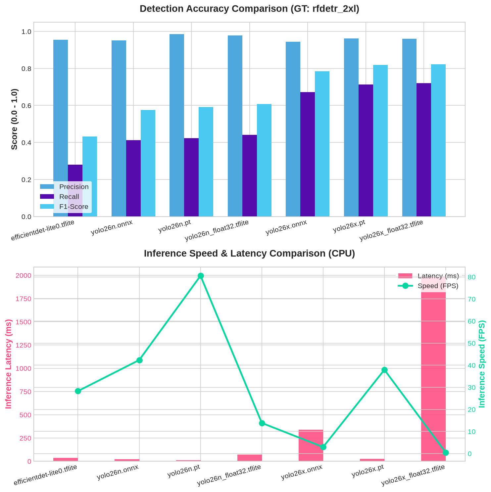

# Pedal Revolution

Pedal Revolution is a gamified bicycle side-camera app.

When riding a bike in traffic, the app should help show when you pass cars and when cars pass you.
Over time, those events can turn into points, streaks, and friendly competition.

## Goal

- Detect passing events while the phone is mounted on a bike and filming traffic.
- Track when the rider overtakes cars and when cars overtake the rider.
- Turn those events into a game-like score and visual feedback.

## Method

- Native Android app written in Kotlin.
- Jetpack Compose for the UI.
- CameraX for live camera preview and frame analysis.
- **ONNX Runtime** for high-performance on-device car detection (**YOLOv10**).
- **LiteRT (formerly TensorFlow Lite)** as an alternative inference engine.
- **RF-DETR** (2XL version) used as the ground truth reference for offline benchmarking.
- **On-device tracking** and state estimation.
- **Python-based backend** (FastAPI) for detection logging and a React-based dashboard for visualization.
- **16 KB page size support** for modern Android 15+ compatibility.

## Roadmap

- [x] 0. Pick a good name
- [x] 1. Create a minimal Android/Kotlin CameraX app.
- [x] 2. Add a live camera preview.
- [x] 3. Add frame analysis.
- [x] 4. Add a car detector (YOLOv10 via ONNX Runtime & LiteRT).
- [x] 5. Add simple tracking and counters.
- [ ] 6. Add an arcade-style overlay with effects like "combo" when passing multiple cars in a short time.
- [ ] 7. Add a social feature to compare with friends.
- [x] 8. Collect data to help Ido (Backend integration).
- [ ] 9. Sell said data to data-brokers and retire early.

## TODOs

- [ ] **Improve Tracking**: Implement a more robust tracking algorithm (e.g., Kalman Filter or Sort) to handle occlusions and fast movement.
- [ ] **Efficient Backend Sync**: Shift from sending raw per-frame detections to sending summarized tracked objects to the server to reduce bandwidth.
- [ ] **Model Validation**: Benchmark additional models and validate performance across a wider variety of test videos (different lighting, weather, etc.).
- [ ] **Emulator Testing**: Add a script or guide to simulate moving GPS locations in the emulator for better field-testing.

## Benchmarks

Below is the benchmarking result of the object detection models available in the app's assets folder (`app/src/main/assets`). 

The models were evaluated frame-by-frame on a test video against the largest ground truth model (`rfdetr_2xl`) with an IoU threshold of 0.3 and a score confidence threshold of 0.45.

### Results Table

| Model                     |   TP |   FP |   FN |   Precision |   Recall |   F1-Score |   Latency (ms) |   Speed (FPS) |
|:--------------------------|-----:|-----:|-----:|------------:|---------:|-----------:|---------------:|--------------:|
| efficientdet-lite0.tflite |  170 |    8 |  438 |      0.9551 |   0.2796 |     0.4326 |          35.35 |         28.29 |
| yolo26n.onnx              |  251 |   13 |  357 |      0.9508 |   0.4128 |     0.5757 |          23.61 |         42.35 |
| yolo26n.pt                |  257 |    4 |  351 |      0.9847 |   0.4227 |     0.5915 |          12.42 |         80.51 |
| yolo26n_float32.tflite    |  268 |    6 |  340 |      0.9781 |   0.4408 |     0.6077 |          72.22 |         13.85 |
| yolo26x.onnx              |  409 |   24 |  199 |      0.9446 |   0.6727 |     0.7858 |         339.26 |          2.95 |
| yolo26x.pt                |  434 |   17 |  174 |      0.9623 |   0.7138 |     0.8196 |          26.34 |         37.96 |
| yolo26x_float32.tflite    |  438 |   18 |  170 |      0.9605 |   0.7204 |     0.8233 |        1990.52 |          0.5  |

### Performance Visualization



to run emulator with specific video:
```
~/Android/Sdk/emulator/emulator -avd Medium_Phone -camera-back videofile:/home/yuval/Downloads/IMG_4376.mp4
```
